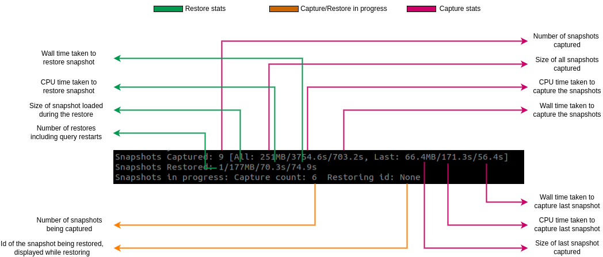

# Operator Snapshot

## Overview

The Operator Snapshot in openLooKeng takes periodic snapshots of the complete state of the query execution. When an error occurs, the query can resume execution from the last successful snapshot. The implementation is based on the standard [Chandy-Lamport algorithm](https://en.wikipedia.org/wiki/Chandy%E2%80%93Lamport_algorithm).

As of release 1.2.0, openLooKeng supports recovery of tasks and worker node failures.

## Enable Recovery framework

Recovery framework is most useful for long running queries. It is disabled by default, and must be enabled or disabled via a session property [`recovery_enabled`](../properties.md#recovery_enabled). It is recommended that the feature is only enabled for complex queries that require high reliability.

## Requirements

To be able to resume execution from a previously saved snapshot, there must be a sufficient number of workers available so that all previous tasks can be restored. To enable distributed snapshot for a query, the following is required:
- at least 2 workers
- at least 50% more available cluster-wide memory resources with tolerance for worker node failure. If constrained by memory, not all queries may be able to recover (see [I44RMW](https://e.gitee.com/open_lookeng/issues/list?issue=I44RMW))
- at least 80% (rounded down) of previously available workers still active for the resume to be successful. If not enough workers are available, the query will not be able to
  resume from any previous snapshot, so the query reruns from the beginning.

## Limitations

- **Supported Statements**: only `INSERT` and `CREATE TABLE AS SELECT` types of statements are supported
   - This does *not* include statements like `INSERT INTO CUBE`
- **Source tables**: can only read from tables in `Hive` catalog
- **Target table**: can only write to tables in `Hive` catalogs, with `ORC` format
- **Interaction with other features**: distributed snapshot does not yet work with the following features:
   - Reuse exchange, i.e. `optimizer.reuse-table-scan`
   - Reuse common table expression (CTE), i.e. `optimizer.cte-reuse-enabled`

When a query that does not meet the above requirements is submitted with distributed snapshot enabled, the query will be executed as if the distributed snapshot feature is _not_ turned on.

## Detection

Error recovery is triggered when communication between the coordinator and a remote task fails for an extended period of time, as controlled by the [`Failure Recovery handling Properties`](<../properties.md#failure-recovery-handling-properties>) configuration.

## Storage Considerations

When query execution is resumed from a saved snapshot, tasks are likely scheduled on different workers than when the snapshot was taken. This means saved snapshot data must be accessible by all workers.

Snapshot data is stored in a file system as specified using the `hetu.experimental.snapshot.profile` property.

Snapshot files are stored under `/tmp/hetu/snapshot/` folder of the file system. All workers must be authorized to read and write to this folder.

Snapshots reflect states in query execution, potentially becoming very large in size and varying significantly from query to query. For example, queries that need to buffer large amounts of data (typically involving ordering, window, join, aggregation, etc. operations), may result in snapshots that include data from an entire table. Ensure that the cluster has enough memory to process the snapshots and the shared file system has sufficient disk space available to store these snapshots before proceeding.

Each query execution may produce multiple snapshots. Contents of these snapshots may overlap. Currently they are stored as separate files. In the future, "incremental snapshots" feature may be introduced to save storage space.

## Performance Overhead

The ability to recover from an error and resume from a snapshot does not come for free. Capturing a snapshot, depending on complexity, takes time. Thus it is a trade-off between performance and reliability.

It is suggested to turn on snapshot capture when necessary, i.e. for queries that run for a long time. For these types of workloads, the overhead of taking snapshots becomes negligible.

## Snapshot statistics

Snapshot capture and restore statistics are displayed in CLI along with query result when CLI is launched in debug mode

Snapshot capture statistics includes number of snapshots captured, size of snapshots captured, CPU Time taken for capturing the snapshots and Wall Time taken for capturing the snapshots during the query.  These statistics are displayed for all snapshots and for last snapshot separately.

Snapshot restore statistics covers number of times restored from snapshots during query, Size of the snapshots loaded for restoring, CPU Time taken for restoring from snapshots and Wall Time taken for restoring from snapshots.  Restore statistics are displayed only when there is restore(recovery) happened during the query.

Additionally, while query is in progress number of capturing snapshots and id of the restoring snapshot will be displayed. Refer below picture for more details 

## Configurations

Configurations related to recovery framework feature can be found in [Properties Reference](<../properties.md#query-recovery>).