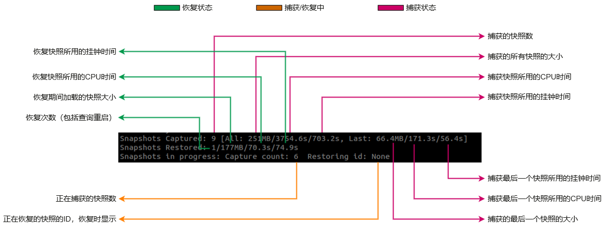

# 可靠查询执行

## 概述

当集群中的节点因网络、硬件或软件问题发生故障时，在故障节点上运行任务的所有查询都将丢失。这可能会严重影响集群生产力并造成资源浪费，尤其对于长时间运行的查询。

解决这一问题的一种方法是自动重新运行受影响的查询。这减少了人工干预的需要，并提高了容错性，但同时会延长总执行时间。

为了保持执行可靠性同时实现更好的性能，openLooKeng中的分布式快照机制定期保存查询执行的完整状态的快照。发生错误时，查询可以从上一个成功的快照恢复执行。该实现基于标准[Chandy-Lamport算法](https://en.wikipedia.org/wiki/Chandy%E2%80%93Lamport_algorithm)。

自版本1.2.0起，openLooKeng支持恢复任务和工作节点故障。

## 启用恢复框架
     
恢复框架对于长时间运行的查询最有用。默认禁用，可以使用会话属性[`recovery_enabled`](properties.md#recovery_enabled)启用和禁用恢复框架。建议仅对可靠性要求高的复杂查询启用该功能。

## 要求

要从之前保存的快照恢复执行，必须有足够数量的可用工作节点，以便恢复所有任务。要对查询启用分布式快照，有以下要求：

- 至少2个工作节点
- 至少之前80%的可用工作节点(向下舍入)仍处于活动状态，以便恢复成功。如果没有足够的工作节点可用, 查询将不能使用任何之前成功的快照进行恢复，查询将从头重新运行。

## 限制

- **支持的语句**：仅支持`INSERT`和`CREATE TABLE AS SELECT`类型的语句
  - 不包括类似`INSERT INTO CUBE`的语句。
- **源表**：只能从`Hive`目录中的表读取。
- **目标表**：只能写入`Hive`目录中的表，格式为`ORC`。
- **与其他功能的交互**：分布式快照目前无法与以下功能一起使用：
  - 重用交换，即`optimizer.reuse-table-scan`
  - 重用公用表表达式（CTE），即`optimizer.cte-reuse-enabled`

在启用分布式快照的情况下提交不满足上述要求的查询时，查询按未启用分布式快照功能的场景执行。

## 检测

当协调器与远程任务之间的通信长时间失败时，将触发错误恢复，由[`故障恢复处理属性`](properties.md#故障恢复处理属性)配置控制。

## 存储注意事项

从保存的快照恢复查询执行时，任务可能会在与保存快照时不同的工作节点上调度。这意味着所有工作节点都必须能够访问保存的快照数据。

快照数据存储在使用`hetu.experimental.snapshot.profile`属性指定的文件系统中。

快照文件存储在文件系统的`/tmp/hetu/snapshot/`文件夹下。必须授权所有工作节点读取和写入此文件夹。

快照反映查询执行中的状态，可能会变得非常大，并且因查询而异。例如，需要缓冲大量数据的查询（通常涉及排序、窗口、连接、聚合等操作）可能会产生包含整个表数据的快照。执行前请确保共享文件系统有足够的可用空间来保存这些快照。

每次查询执行都可能生成多个快照。快照的内容可能会重叠。目前，快照以单独文件的形式存储。未来可能会引入“增量快照”功能，以节省存储空间。

## 性能开销

从错误和快照中恢复需要成本。捕获快照需要时间，时间长短取决于复杂性。因此，需要在性能和可靠性之间进行权衡。

建议在必要时打开快照捕获，例如对于长时间运行的查询。对于这些类型的工作负载，拍摄快照的开销可以忽略不计。

## 快照统计信息

在调试模式下启动CLI时，快照捕获信息和恢复信息将与查询结果一起显示在CLI中。

快照捕获统计信息包括捕获的快照数量、捕获的快照大小、捕获快照所需的CPU时间和在查询期间捕获快照所需的挂钟时间。所有快照和最后一个快照的统计信息会分别显示。

快照恢复信息包括查询期间从快照恢复的次数、加载用于恢复的快照大小、从快照恢复所需的CPU时间和从快照恢复所需的挂钟时间。仅当查询期间发生恢复时，才会显示恢复信息。

此外，在查询正在进行时，将显示捕获的快照数量和恢复的快照的ID。更多详细信息，见下图。

## 配置

与恢复框架功能相关的配置，请参见[属性参考](properties.md#查询恢复)。